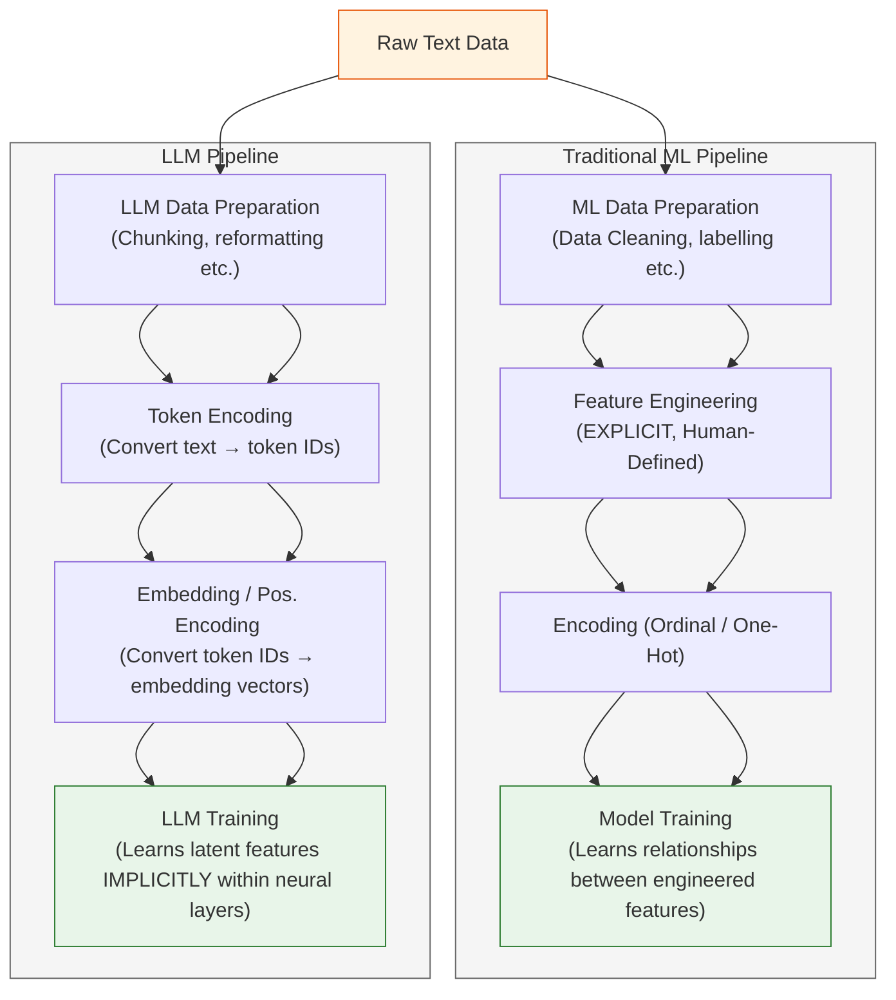
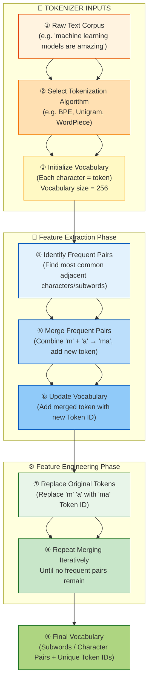
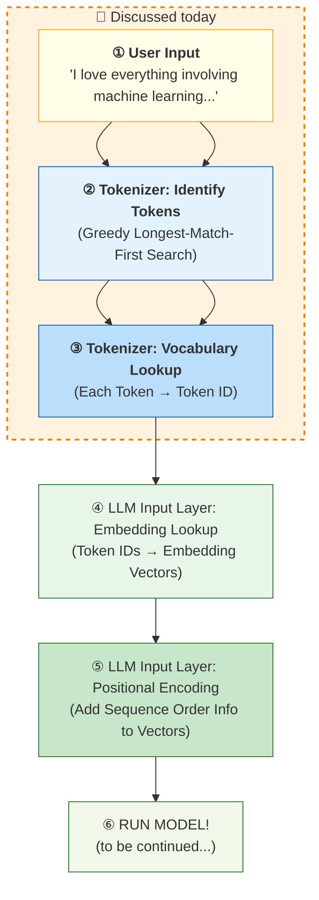

```mermaid name=ml_llm_data_prep_pipeline
flowchart TD
    %% --- Traditional ML Branch ---
    A["Raw Text Data"] --> B["ML Data Preparation<br/>(Data Cleaning, labelling etc.)"]
    B --> C["Feature Engineering<br/>(EXPLICIT, Human-Defined)"]
    C --> D["Encoding (Ordinal / One-Hot)"]
    D --> E["Model Training<br/>(Learns relationships between engineered features)"]

    %% --- LLM Branch ---
    A --> F["LLM Data Preparation<br/>(Chunking, reformatting etc.)"]
    F --> G["Token Encoding<br/>(Convert text → token IDs)"]
    G --> H["Embedding / Pos. Encoding <br/>(Convert token IDs → embedding vectors)"]
    H --> I["LLM Training<br/>(Learns latent features IMPLICITLY within neural layers)"]

    %% --- Tokeniser Details ---
    %% G --> J["Pre-trained Tokeniser<br/>(e.g., BPE - Byte Pair Encoding)"]
    %% J --> K["Feature Extraction: identify frequent subword patterns"]
    %% J --> L["Feature Engineering: map subwords → integer token IDs"]

    %% --- Styling / Grouping ---
    subgraph Traditional_ML["Traditional ML Pipeline"]
        B --> C --> D --> E
    end

    subgraph LLM["LLM Pipeline"]
        F --> G --> H --> I
    end

    style Traditional_ML fill:#f5f5f5,stroke:#666,stroke-width:1px
    style LLM fill:#f5f5f5,stroke:#666,stroke-width:1px
    style A fill:#fff3e0,stroke:#e65100,stroke-width:1px
    style E fill:#e8f5e9,stroke:#2e7d32,stroke-width:1px
    style I fill:#e8f5e9,stroke:#2e7d32,stroke-width:1px
```

```mermaid name=tokenizer_process
flowchart TD
    %% --- INPUT STAGE ---
    A["① Raw Text Corpus<br/>(e.g. 'machine learning models are amazing')"] --> B["② Select Tokenization Algorithm<br/>(e.g. BPE, Unigram, WordPiece)"]
    B --> C["③ Initialize Vocabulary<br/>(Each character = token)<br/>Vocabulary size = 256"]

    %% --- FEATURE EXTRACTION STAGE ---
    C --> D["④ Identify Frequent Pairs<br/>(Find most common adjacent characters/subwords)"]
    D --> E["⑤ Merge Frequent Pairs<br/>(Combine 'm' + 'a' → 'ma', add new token)"]
    E --> F["⑥ Update Vocabulary<br/>(Add merged token with new Token ID)"]

    %% --- FEATURE ENGINEERING STAGE ---
    F --> G["⑦ Replace Original Tokens<br/>(Replace 'm' 'a' with 'ma' Token ID)"]
    G --> H["⑧ Repeat Merging Iteratively<br/>Until no frequent pairs remain"]

    %% --- OUTPUT STAGE ---
    H --> I["⑨ Final Vocabulary<br/>(Subwords / Character Pairs + Unique Token IDs)"]

    %% --- STYLING ---
    style A fill:#fff3e0,stroke:#e65100,stroke-width:1px
    style B fill:#ffe0b2,stroke:#f57c00,stroke-width:1px
    style C fill:#fff9c4,stroke:#f9a825,stroke-width:1px
    style D fill:#e3f2fd,stroke:#1565c0,stroke-width:1px
    style E fill:#bbdefb,stroke:#1565c0,stroke-width:1px
    style F fill:#90caf9,stroke:#1565c0,stroke-width:1px
    style G fill:#e8f5e9,stroke:#2e7d32,stroke-width:1px
    style H fill:#c8e6c9,stroke:#2e7d32,stroke-width:1px
    style I fill:#aed581,stroke:#2e7d32,stroke-width:1px

    %% --- GROUP LABELS ---
    subgraph TI["🧩 TOKENIZER INPUTS"]
        A --> B --> C
    end

    subgraph FE["🧠 Feature Extraction Phase"]
        D --> E --> F
    end

    subgraph EN["⚙️ Feature Engineering Phase"]
        G --> H
    end

```

```mermaid name=llm_encoding
flowchart TD
    %% --- User Input ---
    A["<b>① User Input</b><br/>'I love everything involving machine learning...'"]

    %% --- Tokenizer Stage ---
    A --> B["<b>② Tokenizer: Identify Tokens</b><br/>(Greedy Longest-Match-First Search)"]
    B --> C["<b>③ Tokenizer: Vocabulary Lookup</b><br/>(Each Token → Token ID)"]

    %% --- LLM Input Processing ---
    C --> D["④ LLM Input Layer: Embedding Lookup<br/>(Token IDs → Embedding Vectors)"]
    D --> E["⑤ LLM Input Layer: Positional Encoding<br/>(Add Sequence Order Info to Vectors)"]

    %% --- LLM Learning ---
    E --> F["⑥ RUN MODEL!<br/>(to be continued...)"]

    %% --- Today's Lesson ---
    subgraph TL["🧠 Discussed today"]
        A --> B --> C
    end

    %% --- Styling ---
    style TL fill:#fff3e0,stroke:#f57c00,stroke-width:2px,stroke-dasharray: 5 5
    style A fill:#fffde7,stroke:#f9a825,stroke-width:1px
    style B fill:#e3f2fd,stroke:#1565c0,stroke-width:1px
    style C fill:#bbdefb,stroke:#1565c0,stroke-width:1px
    style D fill:#e8f5e9,stroke:#2e7d32,stroke-width:1px
    style E fill:#c8e6c9,stroke:#2e7d32,stroke-width:1px
    style F fill:#f1f8e9,stroke:#2e7d32,stroke-width:1px


```