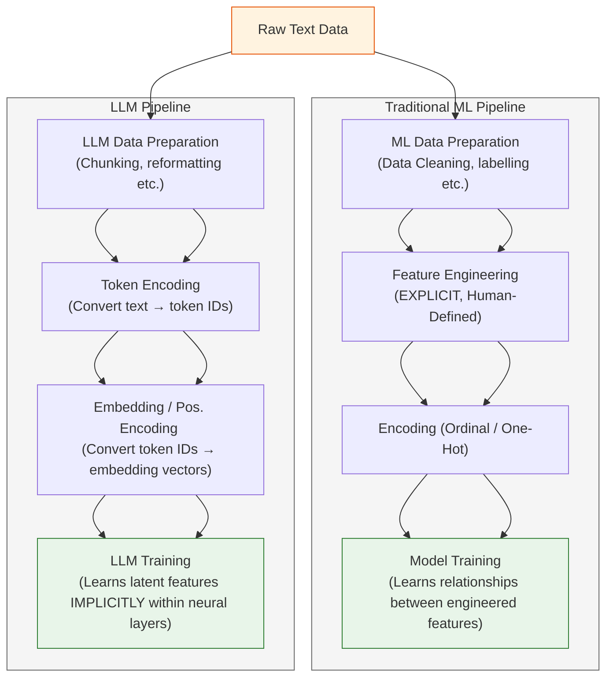
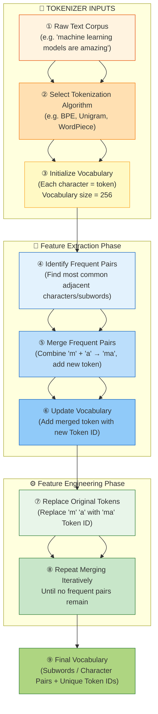

```mermaid name=llm_encoding
flowchart TD
    %% --- User Input ---
    A["<b>① User Input</b><br/>'I love everything involving machine learning...'"]

    %% --- Tokenizer Stage ---
    A --> B["<b>② Tokenizer: Identify Tokens</b><br/>(Greedy Longest-Match-First Search)"]
    B --> C["<b>③ Tokenizer: Vocabulary Lookup</b><br/>(Each Token → Token ID)"]

    %% --- LLM Input Processing ---
    C --> D["④ LLM Input Layer: Embedding Lookup<br/>(Token IDs → Embedding Vectors)"]
    D --> E["⑤ LLM Input Layer: Positional Encoding<br/>(Add Sequence Order Info to Vectors)"]

    %% --- LLM Learning ---
    E --> F["⑥ RUN MODEL!<br/>(to be continued...)"]

    %% --- Today's Lesson ---
    subgraph TL["🧠 Discussed today"]
        A --> B --> C
    end

    %% --- Styling ---
    style TL fill:#fff3e0,stroke:#f57c00,stroke-width:2px,stroke-dasharray: 5 5
    style A fill:#fffde7,stroke:#f9a825,stroke-width:1px
    style B fill:#e3f2fd,stroke:#1565c0,stroke-width:1px
    style C fill:#bbdefb,stroke:#1565c0,stroke-width:1px
    style D fill:#e8f5e9,stroke:#2e7d32,stroke-width:1px
    style E fill:#c8e6c9,stroke:#2e7d32,stroke-width:1px
    style F fill:#f1f8e9,stroke:#2e7d32,stroke-width:1px
    end

```


```mermaid name=mod18_overview
flowchart TD
    U["<b>User Input</b><br/>URL + Query"]

    U --> V["URL & Query Validation<br/>(Regex + Pydantic)"]
    V --> D["Webpage → Sentences<br/>(df)"]

    D --> E1["Embeddings<br/>(cos / dot)"]
    D --> E2["TF-IDF"]
    D --> E3["BM25"]

    U --> Q["Validated Query"]

    Q --> S1["Dense Search"]
    Q --> S2["TF-IDF Search"]
    Q --> S3["BM25 Search"]

    S1 --> R["Ranked Results DF"]
    S2 --> R
    S3 --> R
    
    %% --- Styling ---
    style U fill:#fffde7,stroke:#f9a825
    style V fill:#e3f2fd,stroke:#1565c0
    style D fill:#e8f5e9,stroke:#2e7d32
    style R fill:#f9fbe7,stroke:#9e9d24
    end
```