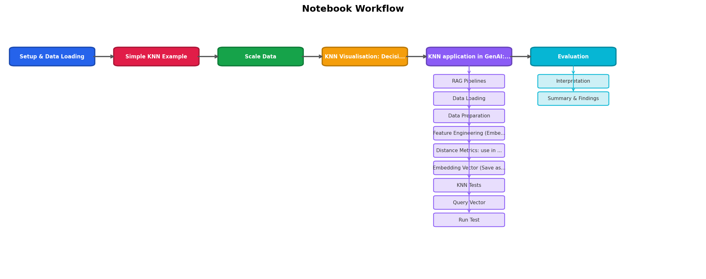
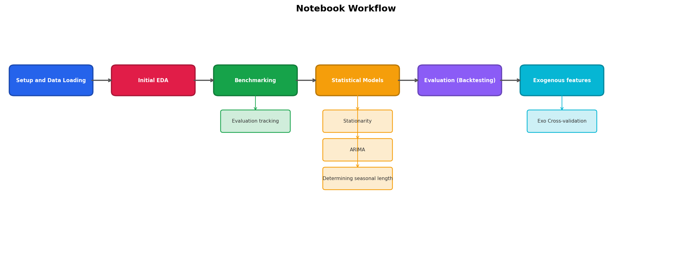

# Formatting and Standardising Notebook Script

This script takes a Jupyter notebook and tidies it up — like a copy-editor for code notebooks. It numbers the sections, builds a clickable table of contents, removes clutter, fixes typos, and makes every chart look consistent. You run it once and the notebook comes out clean and standardised.

```
python scripts/format_notebook.py notebooks/my_notebook.ipynb
```

The script works in **six steps**, each doing one specific job. You can run all of them (the default) or pick only the ones you need with `--steps 1,3,5`.

e.g. to run Mermaid Diagram from your CLI, python scripts/format_notebook.py notebooks/my_notebook.ipynb --steps 4
(just make sure the paths for format_notebook.py and your notebook are correct)

---

## How the steps fit together



Each step reads the notebook, makes its changes, and passes the result to the next step. A backup of the original file is always saved first (`.bak`), so nothing is lost.

---

## Step 1 — Headings & Table of Contents

**What it does:** Numbers every section heading and builds a clickable table of contents at the top of the notebook.

Think of it like adding chapter numbers and a contents page to a book.

### Before

```markdown
## Data Preparation
### Handling Missing Values
## Model Training
```

### After

```markdown
### Table of Contents
1. [Data Preparation](#1-data-prep)
   - 1.1 [Handling Missing Values](#1-1-handling-missing)
2. [Model Training](#2-model-training)

---

## 1. Data Preparation <a id='1-data-prep'></a>
### 1.1. Handling Missing Values <a id='1-1-handling-missing'></a>

---

## 2. Model Training <a id='2-model-training'></a>
```

Each heading gets:
- A **number** (1, 2, 3... for sections; 1.1, 1.2... for subsections)
- A **bookmark** (the `<a id='...'>` tag) so the table of contents links jump straight to it
- A **horizontal rule** (`---`) above each major section for visual separation

The table of contents is inserted right after the notebook title.

---

## Step 2 — Import Cleanup

**What it does:** Scans every `import` line and checks whether the imported library is actually used anywhere in the notebook. If it isn't, the line is removed. Duplicates are also removed.

Think of it like clearing unused apps off your phone — they take up space but do nothing.

### Before

```python
import pandas as pd
import numpy as np
import os               # never used anywhere
import seaborn as sns
import seaborn as sns   # accidentally imported twice
```

### After

```python
import pandas as pd
import numpy as np
import seaborn as sns
```

`os` was removed because no cell ever calls it. The second `seaborn` line was removed because it's a duplicate.

---

## Step 3 — Visualisation Style

**What it does:** Injects a shared style block so every chart in the notebook uses the same fonts, colours, and sizes. It also replaces hard-coded chart dimensions with standardised presets.

Think of it like applying a company brand template to a slide deck — every chart gets the same look automatically.

### The style block it adds

```python
# ── Visualization Style ──────────────────────────────────────────────
import pathlib, sys
sys.path.insert(0, str(pathlib.Path.cwd().parent))
from helpers.visuals import configure_style
FIG = configure_style()
```

This loads a shared style configuration and creates a `FIG` object with preset sizes.

### How chart sizes get standardised (WIP)

| Preset | When it's used |
|---|---|
| `FIG.SINGLE` | One chart on its own |
| `FIG.DOUBLE` | Two charts side by side |
| `FIG.TRIPLE` | Three charts in a row |
| `FIG.GRID_2x2` | A 2x2 grid of charts |
| `FIG.GRID_3x2` | A 3x2 grid of charts |
| `FIG.TALL` | A single tall chart (e.g. heatmap) |

### Before

```python
fig, ax = plt.subplots(1, 2, figsize=(14, 5))
```

### After

```python
fig, ax = plt.subplots(1, 2, figsize=FIG.DOUBLE)
```

The script also:
- Adds `import seaborn as sns` if it's missing
- Removes redundant `fontsize=` settings (the style template handles those globally)
- Adds `plt.tight_layout()` before `plt.show()` where missing, so charts don't overlap

NOTE: I don't love how this currently works. It's a little inconsistent. I will work on it over time! 
---

## Step 4 — Workflow Diagram

**What it does:** Reads the section headings from the notebook and generates a coloured flow diagram showing how the notebook is structured. The diagram is saved as a PNG image and embedded in the notebook just below the table of contents.

Think of it like an infographic at the start of a recipe showing every stage at a glance.

### Example output



Each coloured box is a major section. Smaller boxes underneath show subsections. Arrows show the reading order from left to right (or top to bottom for longer notebooks).

The image is automatically saved to the `images/` folder with the notebook's name, e.g. `images/Mod10_Time_Series_simple_flow.png`.

---

## Step 5 — Spelling & Polish

**What it does:** Scans all text (markdown explanations and code comments) for common misspellings and fixes them automatically.

Think of it like the red squiggly line in a word processor, except it fixes the mistakes for you.

### Some examples from the built-in dictionary

| Typo | Corrected to |
|---|---|
| `modle` | `model` |
| `prediciton` | `prediction` |
| `accuray` | `accuracy` |
| `paramters` | `parameters` |
| `feauture` | `feature` |
| `algorythm` | `algorithm` |
| `nueral` | `neural` |
| `regresion` | `regression` |
| `seperate` | `separate` |

The script handles capitalisation — if the typo starts with a capital letter, the fix does too (`Modle` becomes `Model`).

---

## Step 6 — Function Documentation

**What it does:** Finds every function defined in the notebook and adds two things: **type hints** (what kind of data goes in and comes out) and a **docstring** (a one-line description of what the function does).

Think of it like labelling every drawer in a filing cabinet — you can see what's inside without opening it.

### Before

```python
def clean_data(df, n_rows, is_test):
    missing = df.isnull().sum()
    return df.dropna()
```

### After

```python
def clean_data(df: pd.DataFrame, n_rows: int, is_test: bool) -> pd.DataFrame:
    """Clean data."""
    missing = df.isnull().sum()
    return df.dropna()
```

The script guesses types using common naming conventions:

| Parameter pattern | Inferred type |
|---|---|
| `df`, `data`, `df_*` | `pd.DataFrame` |
| `n_*`, `num_*`, `max_*` | `int` |
| `is_*`, `has_*`, `use_*` | `bool` |
| `X`, `y`, `matrix` | `np.ndarray` |
| `path`, `filename`, `url` | `str` |

It also looks at default values — if a parameter defaults to `True`, it's typed as `bool`; if it defaults to `0.5`, it's typed as `float`, and so on.

Functions that already have type hints are left alone.

---

## Options

| Flag | What it does |
|---|---|
| `--steps 1,3` | Only run specific steps (e.g. just headings and style) |
| `--dry-run` | Show what *would* change without actually saving anything |
| `--ai` | Reserved for future AI-powered spelling and documentation (not yet active) |

### Example: preview changes without saving

```
python scripts/format_notebook.py notebooks/my_notebook.ipynb --dry-run
```

### Example: only fix headings and spelling

```
python scripts/format_notebook.py notebooks/my_notebook.ipynb --steps 1,5
```

---

## Safety

The script always creates a backup before saving. If you run it on `my_notebook.ipynb`, you'll find `my_notebook.ipynb.bak` in the same folder — that's your original, untouched file.
